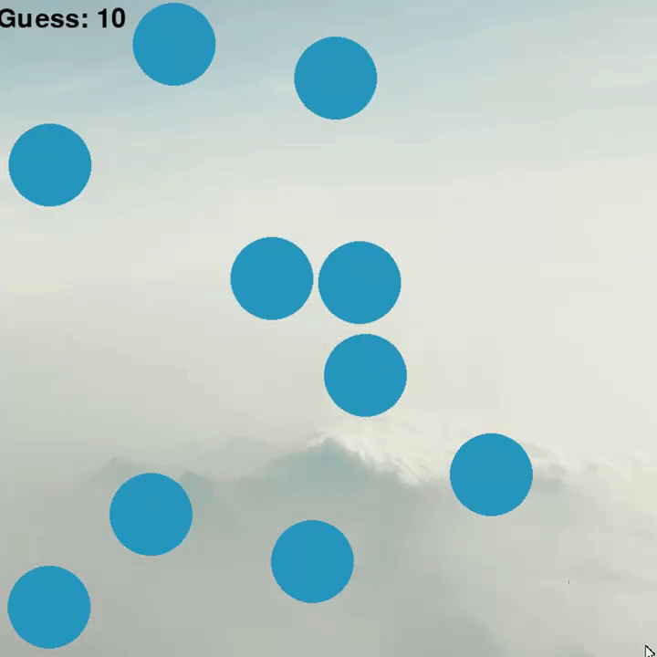

# Memory Game
This is a memory game created using PyGame!

## How to Play
When you start the game you'll begin at <i>Level 1</i>. At the beginning of each round, you will be
shown numbers with circle with them ranging from 1 to the level you are on. Afterwards, the numbers
in the circle will be covered and the goal is guess the order of the circles (starting from 1) until
you uncover them all. If at any point the wrong order is guessed you will have to go back around and
if of them are uncovered you will move onto the next round with an additional circle. Good luck!